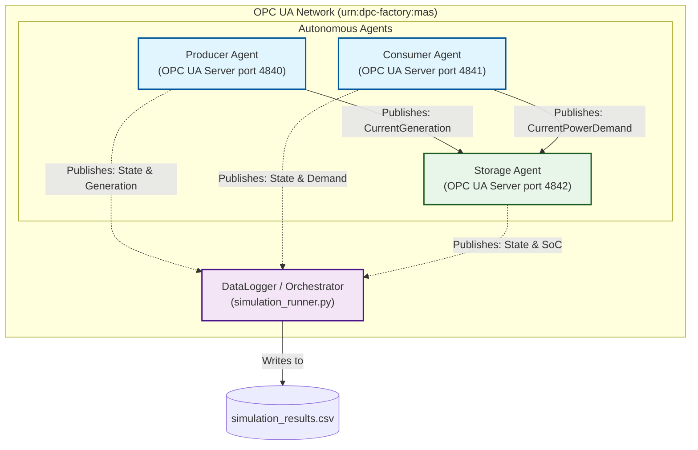

# Distributed Production (DPC) Factory – OPC UA Multi-Agent System 🏭⚡

This repository contains a Python-based prototypical implementation of a Multi-Agent System (MAS) for distributed factory energy coordination. It leverages **OPC UA** (`asyncua`) as the core communication middleware to enable standardized, scalable, and near real-time interaction between autonomous energy agents.

This prototype was developed as a conceptual demonstration for the **FAPS (Chair of Manufacturing Automation and Production Systems) university project** focusing on dynamic energy control in future DC microgrids.

---

## 🏗️ Architecture & Features

The system models a decentralized industrial energy grid where every physical entity is an autonomous agent. Each agent encapsulates a specialized physics simulation loop and interacts with the network via OPC UA.

**Note on Scope:** This repository focuses strictly on the *communication infrastructure* (OPC UA Pub/Sub, `asyncio`). The agents currently use simple deterministic logic to react to network changes. They serve as a foundational "sandbox" upon which advanced AI and negotiation algorithms (e.g., Contract Net Protocols, Reinforcement Learning) can be built in the future.

### System Architecture Flowchart




### Key Features
*   **Dual-Role OPC UA Nodes:** Every agent runs an asynchronous OPC UA Server to expose its state, while actively acting as an OPC UA Client to subscribe to peer data.
*   **Asynchronous Pub/Sub:** Uses `asyncua` data-change notifications (`SubscriptionHandler`) to push state updates without wasteful continuous polling.
*   **Semantic Information Model:** Agents utilize an object-oriented taxonomy mapping directly to OPC UA nodes (e.g., `CurrentPowerDemand`, `StateOfCharge`).
*   **Decentralized Decision Making:** Storage agents automatically calculate net power balance based on subscribed peer variables to toggle between Charging and Discharging states.

### Included Agent Types
1.  **`ProducerAgent`:** Models renewable energy (PV). Outputs a Gaussian solar curve with additive noise.
2.  **`ConsumerAgent`:** Models an arbitrary production line. Simulates cyclic sinusoidal power demand.
3.  **`StorageAgent`:** Models a Battery Energy Storage System (BESS). Listens to network demand/generation to actively balance the microgrid and calculate State-of-Charge (SoC).

---

## 🚀 Getting Started

### Prerequisites
*   Python 3.10+
*   The `asyncua` library

### Installation
Clone the repository and install the dependencies:
```bash
git clone https://github.com/YOUR_GITHUB_USERNAME/opcua-dpc-mas.git
cd opcua-dpc-mas
pip install -r requirements.txt
```

### Running the Simulation
The orchestrator script (`simulation_runner.py`) spins up a local cluster of three agents on sequential ports (`4840`, `4841`, `4842`) and tracks their state over time.

```bash
python simulation_runner.py
```

**What happens:**
1.  The Consumer, Producer, and Storage agents start their respective OPC UA servers.
2.  The Storage agent subscribes to the Producer's and Consumer's output nodes.
3.  A centralized DataLogger script connects to all agents and subscribes to 6 critical data nodes.
4.  The simulation runs for 60 seconds (representing accelerated time).
5.  All state changes (power fluctuations, SoC changes) are written to `simulation_results.csv`.

---

## 📂 Repository Structure

*   **`opcua_agent.py`:** The core communication layer. Defines the `OpcUaAgent` base class, node initialization patterns, and client-side pub/sub wiring.
*   **`factory_agents.py`:** Domain logic. Subclasses the base agent to create the specialised `Consumer`, `Producer`, and `Storage` behaviours.
*   **`simulation_runner.py`:** Scenario orchestrator and CSV DataLogger.
*   **`requirements.txt`:** Project dependencies.

---

## 💡 Motivation & FAPS Application

This prototype was built as a practical sandbox to explore the complexities of Agent-to-Agent communication in Python using established industrial standards. It demonstrates a proactive approach to learning asynchronous Python programming (`asyncio`) and OPC UA semantic network modelling. It serves to de-risk the communication layer, providing a solid foundation to focus on the advanced negotiation AI required for the BA/PA/MA position at the FAPS Department.
